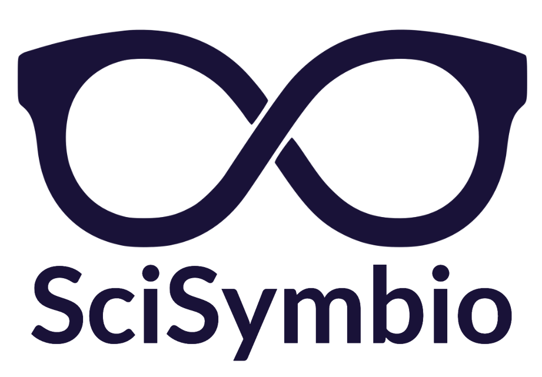

# SciSymbio - The AI Lab Companion



## About SciSymbio

**Solving the multi-billion dollar research reproducibility crisis with the intelligent lab companion of the future.**

SciSymbio is building the AI-powered lab companion that accelerates drug discovery by ensuring every experiment is documented, reproducible, and optimized. We're transforming how pharmaceutical and biotech research is conducted by capturing the tacit knowledge and procedural details that are currently lost.

### The Problem

The scientific community faces a **$28 billion annual reproducibility crisis**. Critical experimental details are lost, procedures aren't properly documented, and valuable tacit knowledge disappears when researchers leave. This slows down drug discovery and wastes billions in research funding.

### Our Solution

An intelligent AI lab companion that:
- 🎤 **Captures everything** - Voice and video documentation of every experiment
- 🤖 **Understands context** - AI-powered analysis of procedures and protocols
- 📊 **Ensures reproducibility** - Automatic documentation and protocol generation
- 🔬 **Accelerates discovery** - Reduces documentation overhead by 70%

### Our Vision

We're building the future of scientific research in three phases:
1. **Phase 1 (Now)**: Audio-based lab companion for real-time documentation
2. **Phase 2**: Computer vision integration for automated procedure tracking
3. **Phase 3**: AR/VR guidance and full lab automation integration

### Validation

- ✅ **100+ customer interviews** with pharma and biotech researchers
- ✅ **Partnerships** with AstraZeneca, Imperial College London, TU Wien
- ✅ **Proven demand** across pharmaceutical, biotech, and academic institutions

## Website

Visit our website: [scisymbio.com](https://scisymbio.com)

## Technology Stack

This website is built with modern web technologies:

- **Vite** - Fast build tool and dev server
- **React** - UI framework
- **TypeScript** - Type-safe JavaScript
- **Tailwind CSS** - Utility-first styling
- **shadcn/ui** - Beautiful component library

## Development

### Prerequisites

- Node.js (v18 or higher)
- npm or yarn

### Local Development

```bash
# Clone the repository
git clone https://github.com/your-username/sci-symbio-vision.git

# Navigate to project directory
cd sci-symbio-vision

# Install dependencies
npm install

# Start development server
npm run dev
```

The site will be available at `http://localhost:8080`

### Build for Production

```bash
# Create production build
npm run build

# Preview production build
npm run preview
```

## Deployment

The website is deployed on GitHub Pages and automatically updates when changes are pushed to the main branch.

## Contact

Interested in learning more or joining our mission?

- Website: [scisymbio.com](https://scisymbio.com)
- Twitter: [@SciSymbio](https://twitter.com/SciSymbio)

---

**SciSymbio** - Making every experiment reproducible, one lab at a time.
